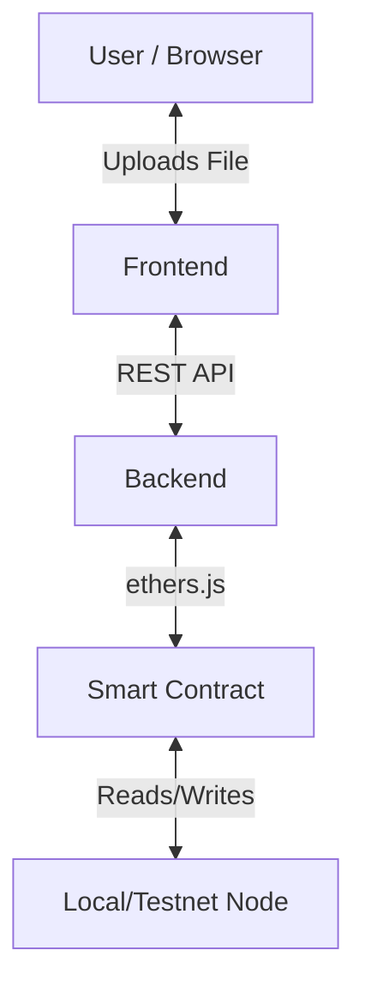

# 🧭 Digital Evidence Vault - Codebase Guide

This document explains how the entire system works, how the pieces fit together, and the recommended order to read the code to understand it.

---

## 🏗️ High-Level Architecture

The system is built in **3 Layers**:

1.  **Frontend (React + Vite)**: The user interface. It sends user actions to the Backend.
2.  **Backend (Node.js + Express)**: The API layer. It handles file processing, hashing, and talks to the Blockchain.
3.  **Blockchain (Solidity + Hardhat)**: The "Source of Truth". It stores immutable records of evidence.

---

## 📚 Recommended Reading Order

To understand the system, read the files in this specific order. This follows the data flow from "Truth" (Blockchain) to "Interface" (Frontend).

### Phase 1: The "Source of Truth" (Blockchain)
Start here. This defines *what* is possible.

1.  **`blockchain/contracts/EvidenceRegistry.sol`**
    *   **What it is:** The heart of the system.
    *   **Look for:** `struct Evidence`, `registerEvidence`, `logCustodyEvent`.
    *   **Key Concept:** Note how it *only* stores hashes (`bytes32`), never large files.

2.  **`blockchain/scripts/deploy.js`**
    *   **What it is:** The deployment script.
    *   **Look for:** How it deploys the contract and *fundamentally* how it writes the address to the `backend/.env` file. This is the glue between Blockchain and Backend.

### Phase 2: The "Bridge" (Backend)
This layer translates web requests into blockchain transactions.

3.  **`backend/utils/crypto.js`**
    *   **What it is:** Simple utility.
    *   **Look for:** `computeFileHash`. We use SHA-256 for everything.

4.  **`backend/services/blockchainService.js`**
    *   **What it is:** The complex logic. It talks to the smart contract.
    *   **Look for:** The `ethers.Contract` setup and functions like `registerEvidence` that wrap the raw Solidity calls.

5.  **`backend/services/policyEngine.js`** & **`aiRiskScoring.js`**
    *   **What they are:** Logic layers that run *before* blockchain interactions.
    *   **Look for:** How `validateCustodyAction` prevents invalid moves off-chain before they hit the chain.

6.  **`backend/server.js`**
    *   **What it is:** The API Router.
    *   **Look for:** Endpoints like `/api/evidence/upload-blockchain`. See how it manages the flow: `Receive File -> Hash It -> AI Check -> Call Blockchain Service -> Return Result`.

### Phase 3: The "Interface" (Frontend)
This is what the user sees.

7.  **`frontend/src/pages/UploadEvidence.tsx`**
    *   **What it is:** The data entry point.
    *   **Look for:** The form submission handler. *Note: You will need to update this to point to the new blockchain API.*

8.  **`frontend/src/pages/ChainOfCustody.tsx`**
    *   **What it is:** The visualization.
    *   **Look for:** How it renders the timeline.

---

## 🔄 Core Data Flows

### 1. Evidence Registration Flow
1.  **User** drops file in Frontend.
2.  **Frontend** sends file to Backend (`POST /upload-blockchain`).
3.  **Backend** calculates `SHA-256(file)`.
4.  **Backend** runs `AIRiskScoring`.
5.  **Backend** calls `EvidenceRegistry.registerEvidence(hash)`.
6.  **Blockchain** mining confirms transaction.
7.  **Backend** returns `txHash` to Frontend.
8.  **Frontend** shows "Success! Block #324".

### 2. Tamper Detection Flow
1.  **User** uploads a file to "Verify" page.
2.  **Backend** calculates hash of uploaded file.
3.  **Backend** calls `EvidenceRegistry.verifyEvidence(hash)`.
4.  **Smart Contract** compares `newHash == storedHash`.
    *   If Mismatch: Contract emits `TamperDetected` event.
5.  **Backend** returns the event details to Frontend.
6.  **Frontend** displays Big Red Warning.

---

## 🚀 How to Run It (The "Lazy" Way)

We created a script that does everything for you.

1.  **Open Terminal**.
2.  **Run:** `./setup-all.sh`

**What this script does:**
*   Compiles the smart contract.
*   Starts a local blockchain node (127.0.0.1:8545).
*   Deploys your contract and saves the address.
*   Configures the Backend to talk to that specific address.
*   Starts Backend (Port 3001) and Frontend (Port 5173).

---

## ⚠️ Current Status & Next Steps

**What is Active:**
*   ✅ **Blockchain:** Fully running, deployed, and logic logic handled.
*   ✅ **Backend:** Fully integrated, reading/writing to the blockchain.

**What Needs Connection:**
*   ⚠️ **Frontend UI:** The React components currently point to mock/local APIs (e.g., they might just save to a JSON array). You need to edit the frontend files to `fetch` from the new `/api/evidence/upload-blockchain` endpoints we just built.

**Immediate Next Task for You:**
*   Go to `frontend/src/pages/UploadEvidence.tsx` and change the API call to point to the real blockchain backend!
